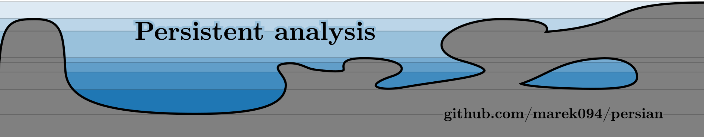
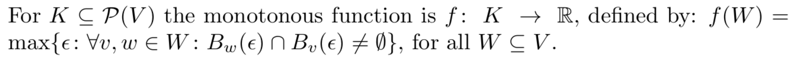

Persian Project




This is a source code of the experiments of unpublished thesis "Persistence Homology and Neural Networks," available at https://github.com/marek094/persian. If you involve it in your research, please cite:
```
    @masterthesis{
        cerny21, 
        title={Persistent Homology and Neural Networks}, 
        school={Charles University, Faculty of Mathematics and Physics},
        author={\v{C}ern\'{y}, Marek}, 
        year={2021}
    }
```

*Note: The definition of monotonous function on pg. 24, fig 2.3 is sketchy, the precise definition follows:*



---
# Persistent Homology and Neural Networks (Thesis Experiments)

## Installation
The last part of our project (Function Graph and DPAE, Chapter 4) has a special dependency
[TorchPH Library](https://c-hofer.github.io/torchph/install/index.html).
Because of this dependency, the usage of AnaConda environment is necessary.

Inside a conda environment or outside one, please install dependencies by running 
```bash
$ pip install -r requirements.txt
```

Before running an experiment, a simple way to add this package to the local `PYTHONPATH` is by
```bash
$ cd path/to/this/repo
$ export PYTHONPATH=src
```

## Data

This section is relevant only to experiments in Chapter 4. Please download data from [Google Research Repository](https://github.com/google-research/google-research/tree/master/dnn_predict_accuracy).
Create this folder structure:
```bash
$ cd path/to/this/repo
$ mkdir -p ../data/cnn_zoo/
$ cd ../data/cnn_zoo/
# [unzip and untar data here]
$ ls -tr1
```
The last command should produce the following output:

```bash
smallcnnzoo-dataset_cifar10.tar
cifar10
smallcnnzoo-dataset_svhn_cropped.tar
smallcnnzoo-dataset_fashion_mnist.tar
smallcnnzoo-dataset_mnist.tar
fashion_mnist
mnist
svhn_cropped
```

_Please note that the folders have nested archives that need to be extracted._


## Boundary Manifold and Double Descent (Chapter 3)

```bash
$ # Print all options 
$ python experiments/boundary_double_descent.py --print_help
```


Training the network for every width is done by following set of commands:


```bash
$ python experiments/boundary_double_descent.py --width [RESNET-18 WIDTH]
$ scripts/launch_featspace_to_persistence.sh
```

The last command runs a script that builds the Cython package and runs the persistence diagram computation for all saved checkpoints in the `boundary` folder, produced by the previous (the first) command.

For our early experiments, see [Boundary Repo](https://github.com/marek094/boundary).

## CNN Processing and DPAE (Chapter 4)


### Jupyter Notebook Experiments

- Construction 1 (Random Space)

    Notebook: [experiments_notebooks/submission_investigating_cnn_weights_with_giotto_vectorization_SRV.ipynb](https://github.com/marek094/persian/blob/master/experiments_notebooks/submission_investigating_cnn_weights_with_giotto_vectorization_SRV.ipynb) 
    
    Or alternatively: [challenge-iclr-2021/Investigating-CNN-Weights-with-Topology](https://github.com/geomstats/challenge-iclr-2021/tree/main/marek094__Investigating-CNN-Weights-with-Topology)
- Construction 2 (Computation Tree)

    Notebook 1: [experiments_notebooks/topology_of_winning_lottery_tickets.ipynb](https://github.com/marek094/persian/blob/master/experiments_notebooks/topology_of_winning_lottery_tickets.ipynb) 
    
    Notebook 2: [experiments_notebooks/topology_of_winning_lottery_tickets_dnn.ipynb](https://github.com/marek094/persian/blob/master/experiments_notebooks/topology_of_winning_lottery_tickets_dnn.ipynb)

### Python Native Experiments
All the experiments produce the Tensorboard summaries of the train/test loss and train/test R2 scores.


- Construction 3 (Function Graph)

    ```bash
    $ python experiments/datafree_graph.py
    ```
    
    
    ```bash
    $ # Print all options 
    $ python experiments/datafree_graph.py --print_help
    ```


- Construction 4 (Output Space, DPAE)

    ```bash
    $ python experiments/datafree.py
    ```

    ```bash
    $ # Print all non-default options, i.e. to change seed or dataset_base from the cifar10 
    $ python experiments/datafree.py --print_help
    ```


